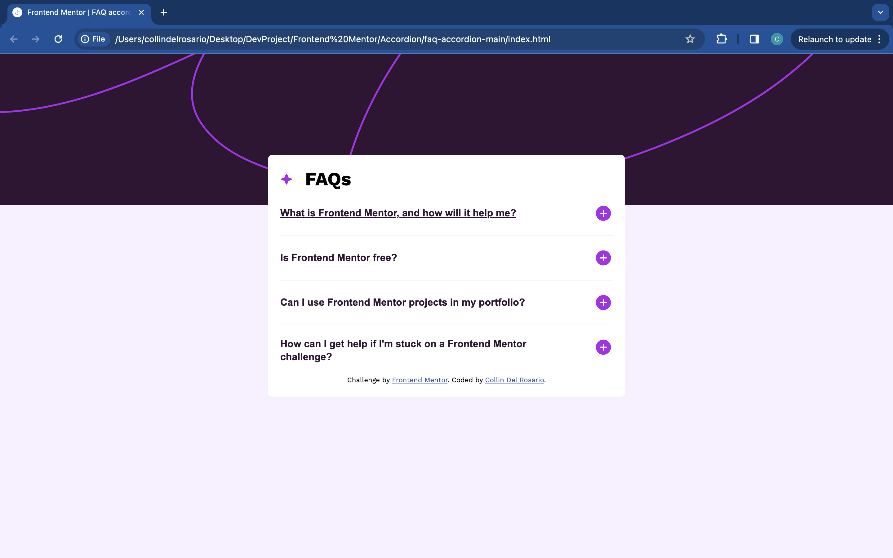

# Frontend Mentor - FAQ accordion solution

This is a solution to the [FAQ accordion challenge on Frontend Mentor](https://www.frontendmentor.io/challenges/faq-accordion-wyfFdeBwBz). Frontend Mentor challenges help you improve your coding skills by building realistic projects.

## Table of contents

- [Overview](#overview)
  - [The challenge](#the-challenge)
  - [Screenshot](#screenshot)
  - [Links](#links)
- [My process](#my-process)
  - [Built with](#built-with)
  - [What I learned](#what-i-learned)
  - [Continued development](#continued-development)
  - [Useful resources](#useful-resources)
- [Author](#author)

**Note: Delete this note and update the table of contents based on what sections you keep.**

## Overview

### The challenge

Users should be able to:

- Hide/Show the answer to a question when the question is clicked
- Navigate the questions and hide/show answers using keyboard navigation alone
- View the optimal layout for the interface depending on their device's screen size
- See hover and focus states for all interactive elements on the page

### Screenshot



### Links

- Solution URL: [Github](https://github.com/delroscol98/FAQ-Accordion)
- Live Site URL: [Github Pages](https://delroscol98.github.io/FAQ-Accordion/)

## My process

### Built with

- Semantic HTML5 markup
- ARIA
- CSS custom properties
- Flexbox
- Mobile-first workflow

### What I learned

In this project, in addition to the feedback that I have recieved from previous projects (responsive design, mobile-first workflow, semantic HTML) I wanted to focus on making this as accessible as possible.

The HTML below is accessble as it starts with an H2 tag, which tells the reader that they are dealing with a heading. The button inside the H2 tag tells allows for interactivity using the TAB key, this caters to users with motor disabilities. The aria attributes inside assist in making the website comprehensible for screen readers for users with sight disabilities.

```html
<h2>
  <button
    type="button"
    aria-expanded="false"
    class="accordion-trigger"
    aria-controls="accordion-panel-1"
    id="accordion-label-1"
  >
    <p class="accordion-label">
      What is Frontend Mentor, and how will it help me?
    </p>
    
  </button>
</h2>
```

The CSS below contirbutes to the accessibility of the website by creating hover, focus, and active states on the buttons. This allows users with disabilities to easily interact with trigger elements.

```css
.accordion-trigger:hover,
.accordion-trigger:focus {
  cursor: pointer;
  text-decoration: underline;
}

.accordion-trigger:active {
  color: #ad28eb;
  text-decoration: none;
}
```

The JS below looks after the logic of interactivity. I am quite proud of this, as this is my first JS project with Frontend Mentor.

```js
if (targetPanel.hidden) {
  targetButton.setAttribute("aria-expanded", true);
  targetIcon.src = "./assets/images/icon-minus.svg";
  targetPanel.hidden = false;
} else {
  targetButton.setAttribute("aria-expanded", false);
  targetIcon.src = "./assets/images/icon-plus.svg";
  targetPanel.hidden = true;
}
```

### Continued development

For future project I would like to continue working on my website accessibility. In this project I used the WAVE Web Accessibility Tool which allowed my to find accessibility errors. Catering my website to people with disabilities will not only make my website more accessible, but will provide a better experience for all users.

### Useful resources

- [WAVE Web Accessibility Evaluation Tool](https://wave.webaim.org/) - This helped me to test the accessibility of my website
- [W3C](https://www.w3.org/WAI/ARIA/apg/patterns/accordion/examples/accordion/) - This provided an example of an accessible accordion for me to follow and learn about ARIA attributes.
- [ADITUS](https://www.aditus.io/patterns/accordion/) - This provided an example of an accessible accordion for me to follow and learn about ARIA attributes.

## Author

- Frontend Mentor - [@delroscol98](https://www.frontendmentor.io/profile/delroscol98)
